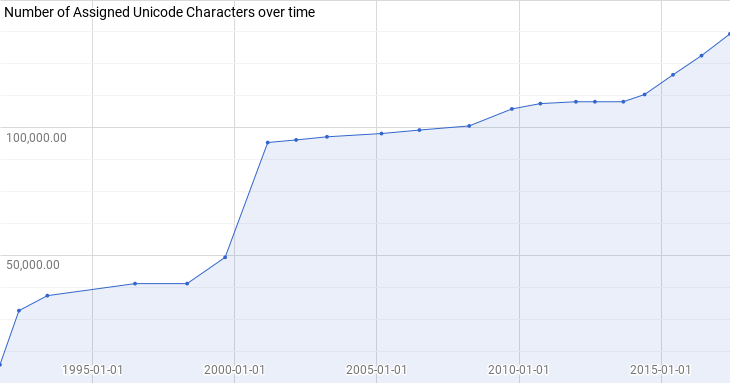

# Unicode and Rust

The Unicode Standard, and related specifications, are a complex system with interdependent terms
and properties. Here’s a summary for working with Unicode when programming in Rust.

## Basic Unicode Concepts

-   **Unicode Abstract Characters** are abstract units of information used for the organization,
    control, or representation of textual data.

-   **Unicode Code Points** are integer values in the **Unicode codespace**: numbers between `0`
    (zero) and `0x10_FFFF`, inclusive.

-   **Unicode Scalar Values** are integer values in a subset of *Unicode Code Points*: the
    *Unicode codespace* excluding high-surrogate and low-surrogate code points:
    `U+D800..U+DFFF`, inclusive.

-   **Unicode Encoded Characters** are *Unicode Scalar Values* assigned to a *Unicode Abstract
    Characters* by the Unicode Standard. Some *Unicode Abstract Characters* are represented with
    a sequence of **Unicode Encoded Characters**.

Unicode Scalar Values marked as *noncharacters* or *reserved* (a.k.a *unassigned*) are not
considered *Unicode Encoded Characters*. Therefore, *Unicode Scalar Values* can have one of the
following *assignment* statuses:

-   **assigned character**, code points that are marked to be an *Encoded Character*,

    Character*, or

-   **unassigned** or **reserved**, code points that can become an *Encoded Character* in the
    future.

In contrast to Unicode Code Points and Unicode Scalar Values (which are sets of numbers written
in stone), the set of Unicode Encoded Characters (a subset of Scalar Values) expands with every
version of Unicode. Figure below shows the number of Unicode Assigned Characters over time, from
1991 to 2017.

In the Unicode Standard, it is recommended that processes do not interpret *unassigned* or
*noncharacter* values as Encoded Characters. This is a general recommendation and many
application decide to *pass through* such code points.

## Rust Compiler and Core Libraries

The Rust Programming language has support for Unicode characters in its core with the `char`
primitive type, which represents a *Unicode Scalar Values*, that is a
**Unicode-version-agnostic** type.

Since the list of *assigned characters* changes with Unicode versions, *Unicode Encoded
Characters* are **not** hard-coded in the Rust language, and only made available in internal and
core libraries for compilation tasks, like when parsing a string in a macro in compile-time, and
basic input and output handling.

## Need for Third-Party Libraries

What is needed for a programming language compiler and its extensions can never be enough for
all other application of text processing.  The needs of applications also varies in size and
shape, and most importantly, the version of Unicode and related data being used for processing.

This is why extended Unicode data and algorithms, along with other internationalization-related
functionalities, are provided as third-party libraries in any major programming language.

UNIC, is such a third-party library for the Rust programming language, which provides
functionalities for Unicode and related standards atop the basic `char` and `str` primitive
types in Rust. UNIC provides access to all kinds of data and algorithms that are
**Unicode-version-dependent**.

## Unicode Version: code vs. data

An important point to remember here is that the version of Unicode data provided in a
third-party library, like UNIC, may be different with the one provided in Rust.

This is critical for some applications, specially those depending on processed data like search
engines. Such applications should not be forced to update all stored data when their code
compiler receives a newer version of Unicode.

Another reason for the separation of Unicode version of the code (the compiler) from the data is
that a data processing codebase should not be held back from upgrading its Unicode version
because of any limitations with upgrading its code to a newer version of the compiler.

And a peculiar case for keeping the Unicode version of the data separate from the code is when
it gets to *Private-Use Code Points*. These code points (like any other code point) receive
*default* character properties, which are specified by the Unicode Standard. However, they *can*
be assigned non-default property values, as deemed by the application. This is something that
should never affect how source code is being compiled, or a compiler being deployed, but only
the data being processed an application with clear boundaries for the Private-Use code points.

## Technical Challenges

A big technical challenge with having more than one library (a language core library and some
third-party libraries) for basic character/string functionalities and text processing for
handling text is the *possibility* of them getting mixed up. This is where every programmer need
to pay attention to which library to use in every situation.

That is why having **one** library that provides majority of functionalities and enforces
consistency between its components is important in this area. UNIC has a goal to enforce this
consistency during its own development time (via integration tests), as well as in application
runtime (assertion in debug mode).

Still, there is one situation that is not avoidable by third-parties: mixing core library and
third-party library in one process.  Here, the burden is on the application developer to avoid
any mixing, or ensure and verify that it is safe to do so.

## See Also

-   [The Unicode Standard](http://www.unicode.org/versions/latest/)

-   [Glossary of Unicode Terms](http://www.unicode.org/glossary/)

-   [The Unicode Library](https://doc.rust-lang.org/1.0.0/unicode/), a Rust core library.

-   [unicode-rs](https://github.com/unicode-rs)

-   [UNIC: Unicode and Internationalization Crates for
    Rust](https://github.com/open-i18n/rust-unic/)
